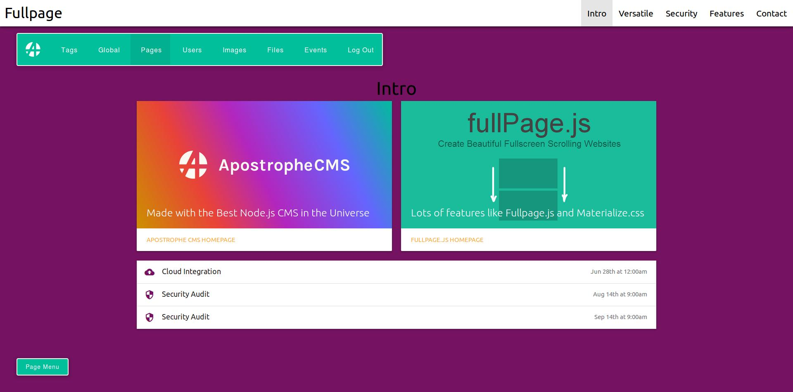

## Apostrophe CMS, Fullpage.js & Materialize CSS

----

### This is my approach to integrate materialize.css into the Apostrophe CMS.

Still in alpha but most main functions for building amazing fullpage, materialized content is working. You have 4 basic widgets but by their flexibility you got thousands of different possiblities to style your page.



### Installing instructions

````
# clone repository
git clone https://github.com/felixlberg/fullpage-cms
# cd into the new project
cd fullpage-cms
# Install our dependencies (most notably, Apostrophe)
npm install
# Add an admin user to the admin group; prompts for password
node app.js apostrophe-users:add admin admin
# Go go go!
mpm start
````

----

For more documentation on Apostrophe CMS, visit the [Apostrophe documentation site](http://apostrophecms.com).

For more documentation on Materialize CSS, visit the [Materialize repository](https://github.com/Dogfalo/materialize)

----
